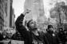
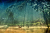

# 사진가분류

> 사진작가는 촬영의 대상과 목적에 따라 인물을 위주로 찍는 인상사진가, 상업목적의 사진을 다루는 광고사진가, 예술사진을 찍는 순수사진가, 신문이나 잡지에 게재하기 위한 사진을 찍는 보도사진가, 자연환경을 대상으로 촬영하는 생태사진가 등으로 나눌 수 있습니다.

[인상사진가](https://github.com/GeekInTheClass/PhotographerCategorization/blob/master/ImagePhoto.md)|
[광고사진가](https://github.com/GeekInTheClass/PhotographerCategorization/blob/master/AdverPhoto.md)|
[순수사진가](https://github.com/GeekInTheClass/PhotographerCategorization/blob/master/PurePhoto.md)|
[보도사진가](https://github.com/GeekInTheClass/PhotographerCategorization/blob/master/JournalPhoto.md)|
[생태사진가](https://github.com/GeekInTheClass/PhotographerCategorization/blob/master/NaturePhoto.md)|
------|------|------|------|------|
|||||
